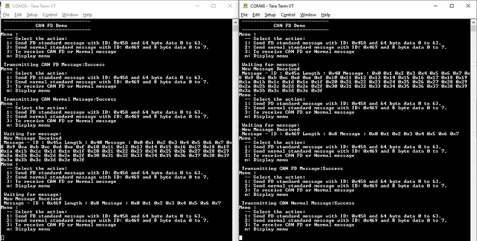

# CAN FD blocking

This example application shows how to use the CAN module to transmit and receive CAN FD messages in polling mode.

## Description

This application transmits CAN FD message to CAN Bus and receives CAN FD message from CAN Bus. To run this application, two evaluation boards of same type are required. These boards acts as different nodes on the CAN bus. Same application is programmed onto both the boards. Boards are connected to PC via UART. While running the application, user can send and receive CAN FD messages between the boards using UART console applications running on the PC.

## Downloading and building the application

To download or clone this application from Github, go to the [top level of the repository](https://github.com/Microchip-MPLAB-Harmony/csp_apps_pic32mz_w1) and click

Path of the application within the repository is **apps/can/can_fd_operation_blocking/firmware** .

To build the application, refer to the following table and open the project using its IDE.

| Project Name      | Description                                    |
| ----------------- | ---------------------------------------------- |
| pic32mz_w1_curiosity.X | MPLABX project for PIC32MZ W1 Curiosity Board |
|||

## Setting up the hardware

The following table shows the target hardware for the application projects.

| Project Name| Board|
|:---------|:---------:|
| pic32mz_w1_curiosity.X | PIC32MZ W1 Curiosity Board |
|||

### Setting up PIC32MZ W1 Curiosity Board

- Connect [ATA6563 click board](https://www.mikroe.com/ata6563-click) to the PIC32MZ W1 Curiosity Board for each board as per the Pin connections shown below

    | PIC32MZ W1 Curiosity Board  | [ATA6563 click board](https://www.mikroe.com/ata6563-click)  |
    |:-----------------------------------:|:-----------------------------------:|
    | PIN14 (RPB9), mikroBUS Connector |  RX (PIN 14) |
    | PIN13 (RPB7), mikroBUS Connector |  TX (PIN 13) |
    | +3.3V, mikroBUS Connector | 3V3 (PIN 7) |
    | +5V, mikroBUS Connector | 5V (PIN 10) |
    | GND, mikroBUS Connector | GND (PIN 9) |
    |||

- Connect [ATA6563 click board](https://www.mikroe.com/ata6563-click)-1 to [ATA6563 click board](https://www.mikroe.com/ata6563-click)-2 using female to female DB9 serial cable
- Connect the USB to TTL serial ([USB UART click board](https://www.mikroe.com/usb-uart-click)) to U1TX pin (pin 23) and U1RX pin (pin 13) of J207 header for each board
- Connect the Debug USB port on the board to the computer using a mini USB cable for each board
- Connect mini USB cable to [USB UART click board](https://www.mikroe.com/usb-uart-click) to the computer for each board (This will enumerate the USB to UART port)

## Running the Application

1. Open the Terminal application (Ex.:Tera term) on the computer
2. Connect to the DEBUG UART Virtual COM port and configure the serial settings as follows:
    - Baud : 115200
    - Data : 8 Bits
    - Parity : None
    - Stop : 1 Bit
    - Flow Control : None
3. Build and Program the application using its IDE
4. In the console associated with board 2, press "3" to receive a CAN FD message
5. In the console associated with board 1, press "2" to transmit a CAN FD message
6. Transmitted message description and status will be displayed in the console window of board 1
7. Received message will be displayed in the console window of board 2
8. Follow the sequence below to send and receive different messages:
    - Press '3' on board 2 and Press '2' on board 1
    - Press '3' on board 2 and Press '1' on board 1
    - Press '3' on board 2 and Press '2' on board 1
9. If the steps are executed in this sequence, the final output in the consoles will be as below (console on the left is the transmitter (board 1) and the one on the right is receiver (board 2)):

    