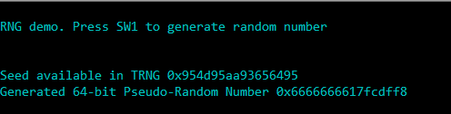

# RNG random number

This example application shows how to use the RNG Peripheral library to generate a pseudo-random number.

## Description

The RNG peripheral has two blocks. One of them is called True Random Number Generator (TRNG) and the other is called Pseudo-Random Number Generator (PRNG). The TRNG generates true random numbers that can be used as seed for the PRNG. The PRNG can generate random numbers of up to 64-bits of length. This application shows how to generate a 64-bit pseudo-random number with the help of PRNG and TRNG.

## Downloading and building the application

To clone or download this application from Github, go to the [main page of this repository](https://github.com/Microchip-MPLAB-Harmony/csp_apps_pic32mz_w1) and then click **Clone** button to clone this repository or download as zip file.
This content can also be downloaded using content manager by following these [instructions](https://github.com/Microchip-MPLAB-Harmony/contentmanager/wiki).

Path of the application within the repository is **apps/rng/rng_random_number/firmware** .

To build the application, refer to the following table and open the project using its IDE.

| Project Name      | Description                                    |
| ----------------- | ---------------------------------------------- |
| pic32mz_w1_curiosity.X | MPLABX project for PIC32MZ W1 Curiosity Board |
|||

## Setting up the hardware

The following table shows the target hardware for the application projects.

| Project Name| Board|
|:---------|:---------:|
| pic32mz_w1_curiosity.X | PIC32MZ W1 Curiosity Board |
|||

### Setting up PIC32MZ W1 Curiosity Board

- Connect the Debug USB port on the board to the computer using a micro USB cable
- On the GPIO Header (J207), connect U1RX (PIN 13) and U1TX (PIN 23) to TX and RX pin of any USB to UART converter (for eg: [USB UART click board](https://www.mikroe.com/usb-uart-click))

## Running the Application

1. Open the Terminal application (Ex.:Tera term) on the computer
2. Connect to the EDBG Virtual COM port and configure the serial settings as follows:
    - Baud : 115200
    - Data : 8 Bits
    - Parity : None
    - Stop : 1 Bit
    - Flow Control : None
3. Build and Program the application project using its IDE
4. Press the switch to generate a 64-bit pseudo-random number (Refer to the table below for switch details)

    | Board | Switch name |
    | ----- | ----------- |
    | PIC32MZ W1 Curiosity Board | SW1 |
    |||

5. Observe the following output in the console:

    